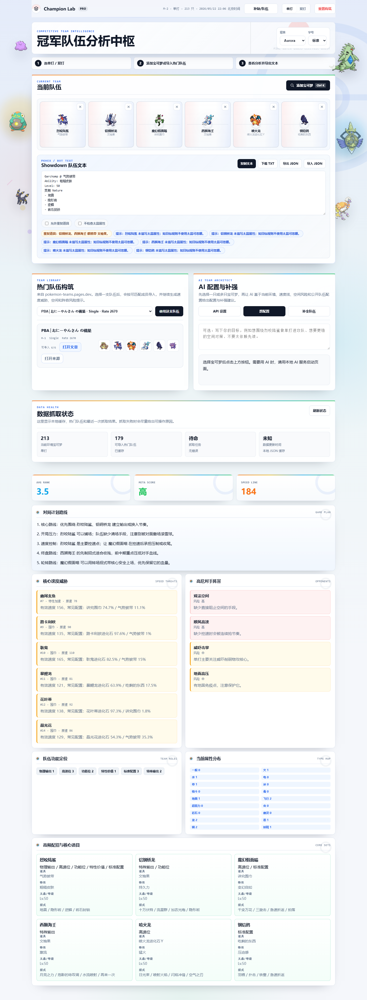
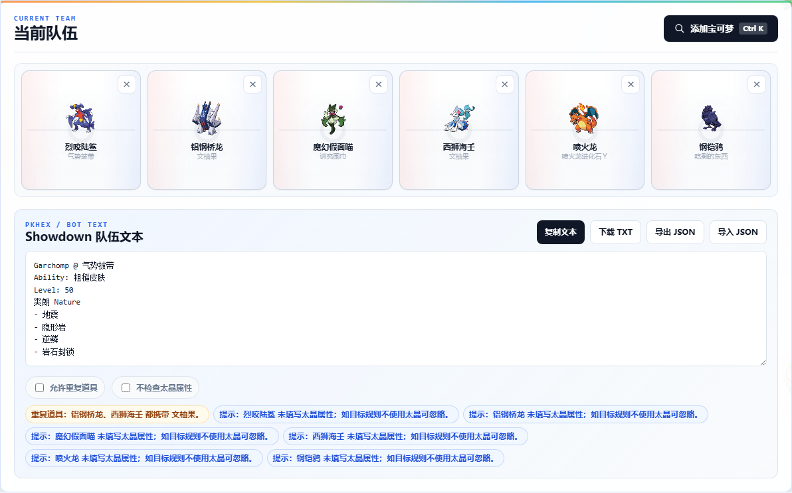
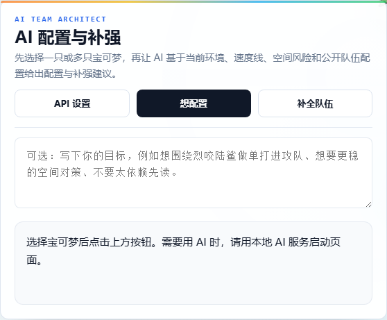
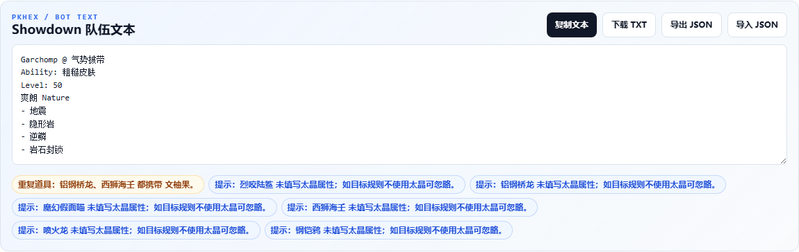
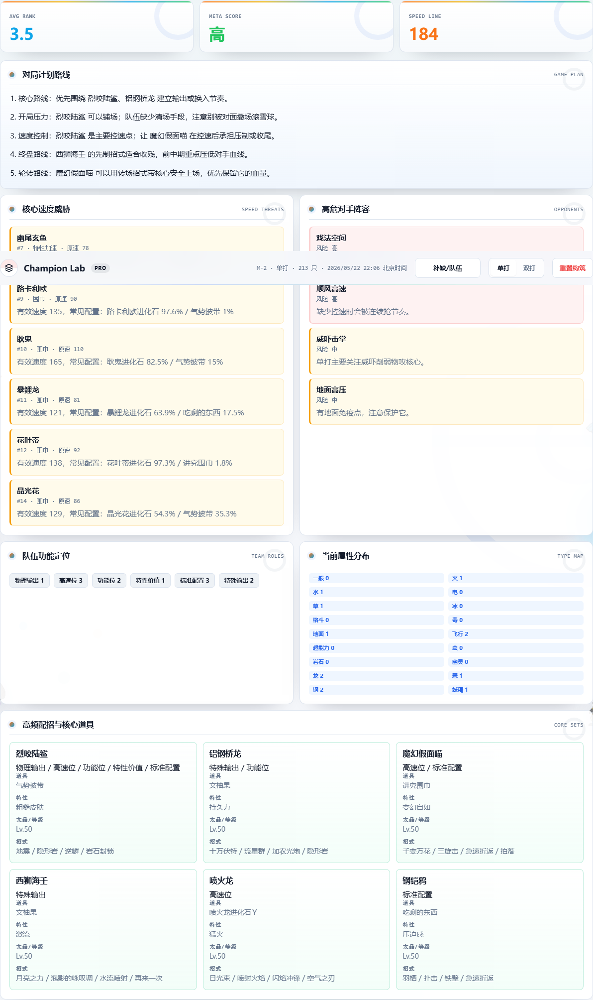

# PokéForge Lab

**一个面向宝可梦竞技玩家的队伍构筑工作台：用环境数据、热门队伍、AI 配队和 PKHeX 友好导出，把组队流程集中到一个页面里。**



PokéForge Lab 是一个本地运行的宝可梦竞技队伍分析与构筑工具。它会缓存环境使用率数据和公开热门队伍，支持单打/双打切换、队伍编辑、AI 配置建议、Showdown 文本导出、基础合法性提示，以及页面内补缺抓取数据。

当前版本：`v0.2.0`  
更新日志：[CHANGELOG.md](CHANGELOG.md)

## 目录

- [效果展示](#效果展示)
- [功能亮点](#功能亮点)
- [版本更新](#版本更新)
- [安装教程](#安装教程)
- [使用教程](#使用教程)
- [数据更新](#数据更新)
- [AI 功能](#ai-功能)
- [部署说明](#部署说明)
- [路线图](#路线图)
- [常见问题](#常见问题)

## 效果展示

### 主界面：环境数据驱动的队伍工作台



### AI 配队：单打和双打分开生成



### PKHeX 友好导出与规则检查



### 队伍分析：对局计划、速度威胁和属性分布



## 功能亮点

- 支持单打 / 双打环境数据切换。
- 从使用率排名中选择宝可梦组队。
- 导入 `pokemon-teams.pages.dev` 的公开热门队伍。
- 每只宝可梦可直接编辑：
  - 道具
  - 特性
  - 性格
  - 努力值
  - 个体值
  - 太晶属性
  - 等级
  - 性别
  - 球种
  - 语言
  - 闪光
  - 招式
- 导出 Showdown 队伍文本，适合导入 PKHeX 或部分队伍机器人。
- 支持复制 Showdown Packed Team 风格文本，方便后续对接 Showdown / poke-env 类流程。
- 支持导出 / 导入 JSON 草稿。
- 自动保存当前队伍，刷新页面后可恢复。
- 根据实际队伍生成对局计划，而不是固定模板。
- 检查常见规则问题：
  - 重复道具
  - 重复宝可梦
  - 多个 Mega 石
  - EV 超过 510
  - 单项 EV 超过 252
  - 单项 IV 超过 31
  - 招式不足 4 个
  - 缺少道具 / 特性 / 性格 / 等级等字段
- 展示速度威胁、属性分布、队伍定位、常见配置和对手风险。
- 内置轻量规则/对战知识模块，按控速、撒场、清场、轮转、终盘、守住等状态给队伍评分。
- 可选 AI 配队：分别生成单打和双打的队伍建议。
- 页面两侧的宝可梦可互动：悬停显示名字，点击加入当前队伍。
- 页面内补缺数据，并显示进度条。
- 页面内显示本地缓存、热门队伍数量和抓取日志。
- 首次启动如果缺少数据，会自动抓取并显示启动进度。

## 版本更新

最新版本：`v0.2.0`

主要更新：

- 接入轻量规则/对战知识模块，让 AI 配队参考控速、撒场、清场、轮转、终盘、守住等规则状态。
- 新增 AI 快速 / 详细 / 多方案模式。
- 新增 Showdown Packed Team 复制。
- 新增 AI 模型下拉选择、模型列表获取和连接测试。
- 新增数据抓取状态、日志和更完整的 README 教程。

完整记录见：[CHANGELOG.md](CHANGELOG.md)

## 安装教程

### 1. 准备环境

你需要先安装：

- [Node.js](https://nodejs.org/) 18 或更高版本；
- Git；
- 一个现代浏览器，推荐 Chrome 或 Edge。

检查本机是否已经装好：

```bash
node -v
npm -v
git --version
```

如果 `node -v` 低于 18，建议先升级 Node.js。

### 2. 下载项目

```bash
git clone https://github.com/lgcr12/pokemon-champion.git
cd pokemon-champion
```

如果你是直接下载 ZIP，解压后进入项目目录即可。

### 3. 安装依赖

```bash
npm install
```

### 4. 启动完整服务

推荐使用这个命令启动，它支持页面访问、数据抓取、热门队伍刷新和 AI 代理：

```bash
npm run start:ai
```

启动成功后，在浏览器打开：

```text
http://127.0.0.1:4174
```

### 5. 首次启动会发生什么

项目默认不提交大型数据缓存。首次启动时，如果缺少这些文件：

- `data/champion-data.json`
- `data/team-data.json`

服务端会自动抓取环境数据和热门队伍。页面会显示启动进度条，数据准备完成后会自动进入应用。

如果热门队伍的 X/Twitter 详情因为没有代理抓不到，页面会给出失败原因；基础使用率数据和快速热门队伍列表仍会尽量加载。

### 6. 只看静态页面

不推荐新用户使用这个模式，因为它没有自动抓取、AI 和刷新 API。但如果你已经有本地 JSON 数据，也可以运行：

```bash
npm run start
```

然后打开：

```text
http://127.0.0.1:4173
```

## 使用教程

### 1. 切换单打 / 双打

页面右上角有 **单打** 和 **双打** 按钮。两种模式会使用不同的环境数据、热门队伍和 AI 配队上下文。

### 2. 添加宝可梦

点击 **添加宝可梦**，或者使用 `Ctrl + K` 打开搜索面板。你可以按中文名、英文 slug 或排名搜索，然后点击宝可梦加入当前队伍。

页面两侧的宝可梦也可以互动：悬停查看名字，点击后会尝试加入当前队伍。

### 3. 编辑单只配置

点击队伍里的宝可梦卡片，可以编辑：

- 道具、特性、性格；
- 努力值、个体值；
- 太晶属性、等级、性别；
- 球种、语言、闪光；
- 4 个招式。

编辑完成后点击 **保存配置**。页面会自动刷新 Showdown 文本和规则提示。

### 4. 使用热门队伍

在 **热门队伍构筑** 区域选择队伍，然后点击 **使用这支队伍**。项目会把能匹配到的成员导入当前队伍，并生成分析结果。

热门队伍数据来自 `pokemon-teams.pages.dev`。如果深度详情抓取失败，通常是因为当前网络无法访问 X/Twitter 或 `fxtwitter` 相关域名。

### 5. 查看队伍分析

队伍变化后，下方会自动更新：

- 平均排名；
- Meta 评分；
- 速度线；
- Matchup 评分；
- 对局计划路线；
- 核心速度威胁；
- 基于 Smogon 环境统计的高危对手阵容；
- 队伍功能定位；
- 属性分布；
- 高频配招与核心道具。

这些内容是辅助判断，不等于对局必胜方案。最终还要结合你自己的规则环境和操作习惯。

### 6. 使用 AI 配队

在 **AI 配置与补强** 区域可以输入目标，例如：

```text
想围绕烈咬陆鲨做单打进攻队，不要太依赖先读。
```

然后点击：

- **想配置**：让 AI 给当前成员推荐配置；
- **补全队伍**：让 AI 基于当前队伍补齐缺口。

AI 区域还可以选择推理模式：

- **快速**：优先给可直接应用的简洁建议；
- **详细**：更重视速度控制、轮转、终盘和双打站位；
- **多方案**：先比较多个方向，再输出最终推荐。

项目会把当前队伍转换成一层类似 PokéLLMon / poke-env 的规则状态：包括控速、撒场、清场、强化、轮转、先制、守住、威吓、地面免疫等标签。AI 配队时会把这些状态一起发送给模型，避免只按热门使用率补队。

AI 默认会优先尝试读取本机 Cockpit / Codex Local Access 配置。如果没有，也可以用 OpenAI 兼容接口，见下方 **AI 功能**。

### 7. 导出给 PKHeX 或机器人流程

队伍配置完成后，查看 **Showdown 队伍文本** 区域：

- 点击 **复制文本**，可以复制到剪贴板；
- 点击 **下载 TXT**，可以保存为文本文件；
- 点击 **Showdown 参考校验**，可以调用本地服务端的 Pokemon Showdown TeamValidator 做辅助校验；
- 点击 **复制 Packed**，可以复制 Showdown packed team 风格文本；
- 点击 **导出 JSON**，可以保存当前草稿；
- 点击 **导入 JSON**，可以恢复之前保存的草稿。

导出的 Showdown 文本适合作为 PKHeX 或部分交换机器人流程的输入。项目会优先按 Pokémon Champions 当前单打/双打数据检查队伍成员、常见招式、常见道具、常见特性、重复道具、多个 Mega 石、EV 超限、招式不足等问题。Showdown 校验只是参考；它只识别英文 Showdown 名称，而且可用池和 Champions 不一定一致，不能作为 Champions 最终合法性标准。

### 8. 刷新和补缺数据

页面顶部有 **补缺/队伍** 按钮。点击后会只抓取本地缺失的数据，并刷新热门队伍。已有完整缓存不会重复抓取。

如果你想手动执行数据脚本，可以看下一节。

### 9. 规则检查开关

Showdown 导出区域下方有规则检查选项：

- **允许重复道具**：某些娱乐规则允许重复道具时可以打开；
- **不检查太晶属性**：目标规则不使用太晶时可以打开。

这些开关只影响页面提示，不会修改队伍文本。

## 数据更新

页面顶部有 **补缺/队伍** 按钮。

点击后会执行快速补缺：

- 只补本地缓存里缺少详情的宝可梦；
- 已有完整数据不会重新抓；
- 同时刷新热门队伍；
- 热门队伍默认使用快速模式，避免抓取过重的 X/Twitter 详情；
- 完成后自动重新加载本地 JSON；
- 顶部会显示进度条和当前进度。

也可以手动运行：

```bash
npm run fetch:data
npm run fetch:teams
npm run fetch:knowledge
npm run fetch:missing-all
npm run fetch:all
```

常用环境变量示例：

```powershell
$env:SEASON="M-2"
$env:FORMATS="single,double"
$env:LIMIT="120"
$env:MISSING_ONLY="1"
$env:TEAM_LIMIT="300"
$env:ENRICH_TEAMS="0"
$env:SMOGON_FORMATS="gen9ou,gen9doublesou,gen9vgc2026"
$env:KNOWLEDGE_POKEMON_LIMIT="120"
npm run fetch:missing-all
```

`fetch:knowledge` 会从 Pokemon Showdown 和 pkmn Smogon stats 采集规则/环境知识，生成本地 `data/battle-knowledge.json`。这个文件会被 AI 配队上下文读取，用来补充常见招式、道具、队友、太晶属性、克制关系、基础种族值和规则字段。

数据优先级是：**Pokémon Champions 当前格式数据 > 热门队伍数据 > Showdown / Smogon 参考知识**。AI 配队和页面校验会优先遵守 Champions 当前可用池；Showdown / Smogon 只用于辅助理解环境趋势、英文规则和 matchup。

## 截图更新

README 里的展示图来自真实浏览器截图，不是设计稿。更新 UI 后可以重新生成截图：

```bash
npm run start:ai
```

保持服务运行，再打开另一个终端执行：

```bash
npm run capture:screenshots
```

默认截图地址是：

```text
http://127.0.0.1:4174
```

如果你把服务部署在其他地址，可以指定 `APP_URL`。

macOS / Linux：

```bash
APP_URL=https://你的部署地址 npm run capture:screenshots
```

Windows PowerShell：

```powershell
$env:APP_URL="https://你的部署地址"
npm run capture:screenshots
```

## AI 功能

PokéForge Lab 不只支持 GPT。只要服务商提供 OpenAI 兼容接口，就可以在页面里配置使用。

### 1. 页面可视化配置

打开页面后，在 **AI 配置与补强** 区域点击 **API 设置**。

可以填写：

- 服务商：OpenAI、DeepSeek、Kimi、通义千问、MiniMax、硅基流动或其他兼容接口；
- 接口类型：`Responses` 或 `Chat Completions`；
- Base URL；
- 模型：优先从下拉框选择常用模型；
- API Key。

配置只保存在当前浏览器的 `localStorage`，不会写入仓库，也不会提交到 GitHub。

填好后可以点击 **测试连接**。如果失败，页面会提示常见原因，例如 API Key 错误、模型不存在、余额不足、Base URL 错误或当前网络无法访问服务商。

如果下拉框里没有你要用的模型，可以先点 **获取模型列表**。项目会通过当前 API Key 和 Base URL 请求服务商的 `/v1/models`，把你账号实际可用的模型加入下拉框。

如果服务商不开放 `/v1/models`，页面可能提示 404 或 405。这不代表 AI API 不能用，只表示无法自动读取模型列表；选择预设模型或 **自定义模型...**，再填写服务商控制台里显示的模型名即可。

### 2. 两个接口类型怎么选

页面里的两个接口不是两个不同模型，而是两种 API 格式：

| 接口类型 | 实际路径 | 什么时候选 |
| --- | --- | --- |
| Responses | `/v1/responses` | OpenAI 新接口，主要给 GPT / OpenAI 模型用 |
| Chat Completions | `/v1/chat/completions` | 大多数兼容模型用这个，比如 Kimi、通义千问、DeepSeek、MiniMax、硅基流动 |

简单判断：

- 用 OpenAI 官方 GPT：优先选 **Responses**；
- 用 Kimi / 通义千问 / DeepSeek / MiniMax / 硅基流动：一般选 **Chat Completions**；
- 用中转站或本地模型：看它文档，如果写的是 `/v1/chat/completions`，就选 **Chat Completions**。

### 3. 常见服务商填写示例

```text
OpenAI
Base URL: https://api.openai.com/v1
模型: 下拉选择 gpt-5 / gpt-5-mini / gpt-4.1-mini / gpt-4.1 / gpt-4o-mini，或点击获取模型列表
接口类型: Responses
```

```text
DeepSeek
Base URL: https://api.deepseek.com
模型: 下拉选择 deepseek-chat / deepseek-reasoner / deepseek-r1 / deepseek-v4-flash，或点击获取模型列表
接口类型: Chat Completions
```

```text
Kimi / Moonshot
Base URL: https://api.moonshot.cn/v1
模型: 下拉选择 kimi-k2-0711-preview 或 moonshot-v1 系列
接口类型: Chat Completions
```

```text
通义千问 / 阿里云百炼
Base URL: https://dashscope.aliyuncs.com/compatible-mode/v1
模型: 下拉选择 qwen-plus / qwen-turbo / qwen-max / qwen-long
接口类型: Chat Completions
```

```text
MiniMax
Base URL: https://api.minimax.io/v1
模型: 下拉选择 MiniMax-M1 / MiniMax-Text-01
接口类型: Chat Completions
```

```text
硅基流动
Base URL: https://api.siliconflow.cn/v1
模型: 下拉选择 deepseek-ai/DeepSeek-V3 / deepseek-ai/DeepSeek-R1 / Qwen/Qwen3-32B
接口类型: Chat Completions
```

如果你使用其他中转站或本地模型服务，只要它兼容 OpenAI 的 `/v1/chat/completions`，就选择 **其他兼容接口** 并填写对应地址。

Base URL 可以带 `/v1`，也可以不带；项目会自动兼容，避免重复拼接 `/v1`。

### 4. AI 常见错误排查

| 页面提示 | 常见原因 | 处理方式 |
| --- | --- | --- |
| 连接失败 | Base URL 写错、网络不通、代理不可用 | 检查服务商地址，必要时开启代理 |
| 401 / unauthorized | API Key 错误或没有权限 | 重新复制 Key，确认 Key 属于当前服务商 |
| model not found | 模型名写错或账号未开通 | 换成控制台里可用的模型 |
| insufficient quota | 余额不足或套餐不可用 | 充值或更换服务商 |
| JSON 解析失败 | 模型没有稳定按 JSON 返回 | 重新生成，或换更强的模型 |

### 5. Cockpit 本地访问

如果本机有 Cockpit / Codex Local Access 配置，服务端会自动读取：

```text
~/.antigravity_cockpit/codex_local_access.json
```

这种方式不需要手动填写 `OPENAI_API_KEY`。

### 6. 环境变量配置

也可以使用环境变量：

```powershell
$env:OPENAI_API_KEY="你的 API Key"
$env:OPENAI_MODEL="gpt-4.1-mini"
$env:OPENAI_BASE_URL="https://api.openai.com/v1"
npm run start:ai
```

AI 接口路径：

```text
POST /api/team-advice
```

## 数据来源

- 环境使用率数据：[PokéCham DB](https://pokechamdb.com/zh-Hans)
- 公开热门队伍：[pokemon-teams.pages.dev](https://pokemon-teams.pages.dev/)
- 热门队伍深度补全时可能访问：`api.fxtwitter.com`

如果 X/Twitter 相关数据抓取失败，页面会提示可能原因。常见原因是当前网络没有代理，无法访问 X/Twitter 或 `fxtwitter` 相关域名。

默认的页面补缺模式会使用快速热门队伍抓取，尽量避免依赖 X/Twitter 深度详情。

## 技术栈

- 前端：原生 HTML、CSS、JavaScript Modules
- 后端：Node.js HTTP Server
- 数据缓存：本地 JSON 文件
- 抓取脚本：Node.js `fetch`
- AI 协议：OpenAI 兼容 `Responses` 和 `Chat Completions`
- 构建方式：无构建步骤，直接运行

## 项目结构

```text
.
├─ app.js                    # 前端应用逻辑
├─ index.html                # 页面入口
├─ styles.css                # UI、布局、动效样式
├─ server.mjs                # 静态服务、AI 代理、数据刷新 API
├─ scripts/
│  ├─ fetch-data.mjs         # 环境数据抓取
│  ├─ fetch-teams.mjs        # 热门队伍抓取
│  └─ capture-screenshots.mjs # README 真实截图生成
├─ data/
│  ├─ champion-data.json     # 本地环境数据缓存，运行后生成
│  └─ team-data.json         # 本地热门队伍缓存，运行后生成
└─ docs/
   ├─ screenshot-dashboard.png
   ├─ screenshot-workbench.png
   ├─ screenshot-ai.png
   ├─ screenshot-export.png
   └─ screenshot-analysis.png
```

## 部署说明

### 本地部署

本地部署推荐直接运行：

```bash
npm run start:ai
```

访问：

```text
http://127.0.0.1:4174
```

### 服务器部署

在服务器上执行：

```bash
git clone https://github.com/lgcr12/pokemon-champion.git
cd pokemon-champion
npm install
npm run start:ai
```

服务默认监听 `4174` 端口。可以用 Nginx、Caddy 或平台自带反向代理，把公网域名转发到：

```text
http://127.0.0.1:4174
```

### 静态部署限制

只做静态托管也可以打开页面和读取已有 JSON，但无法使用：

- 首次启动自动抓取；
- 页面内补缺数据；
- AI 代理接口；
- 服务端失败原因提示。

所以如果希望别人部署后自动抓数据、显示进度条、使用 AI，必须运行 `npm run start:ai`，不能只把 HTML/CSS/JS 丢到静态托管。

### 生产环境建议

- 使用 Node.js 18 或更高版本；
- 确认服务器能访问 `pokechamdb.com` 和 `pokemon-teams.pages.dev`；
- 如果要抓 X/Twitter 相关详情，需要服务器网络能访问 X/Twitter 或相关镜像服务；
- 如果要使用 AI，配置 `OPENAI_API_KEY`、`OPENAI_MODEL` 和 `OPENAI_BASE_URL`，或使用 Cockpit 本地访问；
- 首次抓取生成的 `data/*.json` 会保存在服务器本地。

## 关于 PKHeX 和合法性

PokéForge Lab 提供的是队伍文本和本地草稿导出，不会绕过游戏合法性检查，也不会生成存档或自动联网交换。

导出的 Showdown 文本可以作为 PKHeX 或部分机器人流程的输入，但最终是否合法，仍需要根据目标游戏版本、规则、球种、来源、等级、招式和训练家信息在 PKHeX 或目标平台中确认。

## 路线图

- [x] 单打 / 双打环境切换
- [x] 热门队伍导入
- [x] Showdown 文本导出
- [x] Showdown Packed Team 复制
- [x] 页面内 AI API 配置
- [x] AI 连接测试
- [x] 数据抓取状态和日志
- [x] 基础合法性检查
- [x] 轻量规则/对战知识模块
- [x] AI 快速 / 详细 / 多方案模式
- [ ] 更完整的规则集配置
- [ ] 更多服务商预设
- [ ] 使用流程 GIF
- [ ] Release 打包版本

## 常见问题

### 为什么首次启动要等一会？

因为项目默认不提交大型数据缓存。首次运行时会自动抓取缺失数据，生成本地 JSON。

### 为什么热门队伍抓取失败？

公开队伍列表一般可以抓，但深度详情可能依赖 X/Twitter 或相关镜像服务。如果没有代理，可能会失败。页面会显示失败原因。

### 为什么缺少太晶属性只是提示？

不同规则或导入目标不一定需要太晶属性，所以它不是强制错误。需要太晶规则时，建议手动补全。

### 为什么同队重复道具会警告？

当前按常见竞技规则处理：同一队伍中不允许重复道具。如果你的规则允许重复道具，可以忽略该提示。

### Mega 为什么只能一个？

同一队伍通常只允许一个 Mega 进化位。项目会检查携带 Mega 石的数量，超过 1 个会提示。
## 更新记录

- 修复本地模拟因热池队伍物种名不合法而整队失败的问题。
- 统一前后端 Showdown 物种名归一化，支持日文名、地区形态、Mega / Gmax、雌雄后缀回退。
- 优化配队逻辑，脏数据只跳过单个成员，不再硬性判整队失败。
