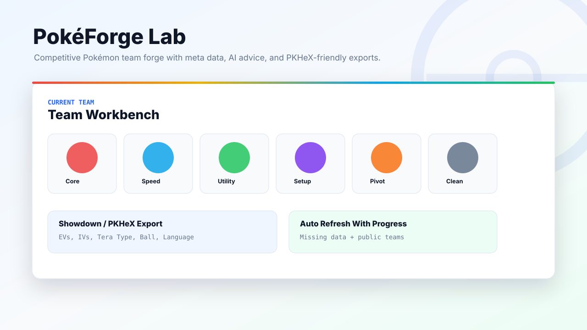
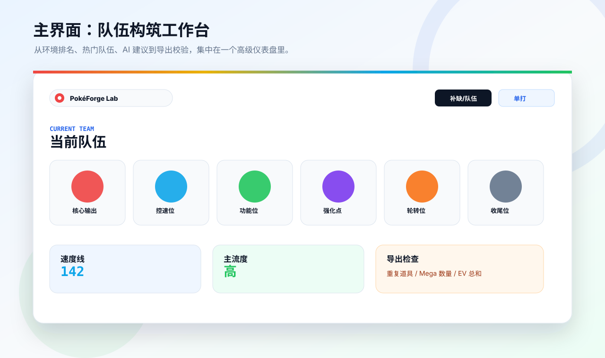
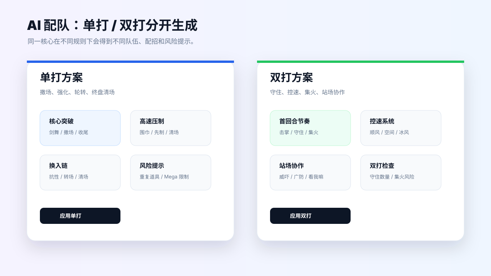
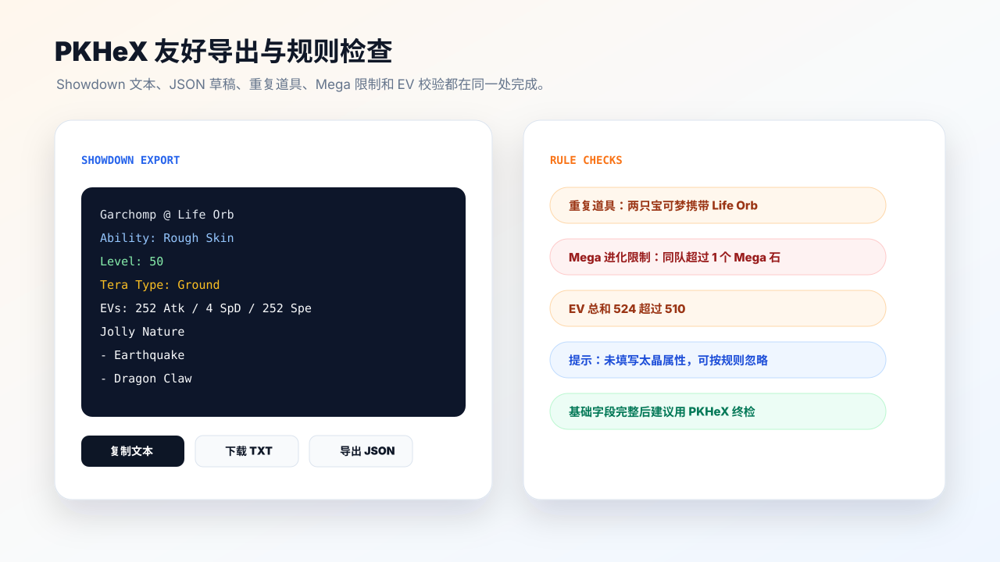
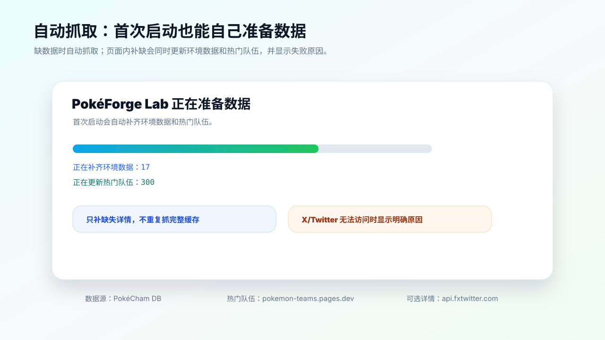

# PokéForge Lab

**一个面向宝可梦竞技玩家的队伍构筑工作台：用环境数据、热门队伍、AI 配队和 PKHeX 友好导出，把组队流程集中到一个页面里。**



PokéForge Lab 是一个本地运行的宝可梦竞技队伍分析与构筑工具。它会缓存环境使用率数据和公开热门队伍，支持单打/双打切换、队伍编辑、AI 配置建议、Showdown 文本导出、基础合法性提示，以及页面内补缺抓取数据。

## 效果展示

### 主界面：环境数据驱动的队伍工作台



### AI 配队：单打和双打分开生成



### PKHeX 友好导出与规则检查



### 自动抓取和补缺进度



## 功能亮点

- 支持单打 / 双打环境数据切换。
- 从使用率排名中选择宝可梦组队。
- 导入 `pokemon-teams.pages.dev` 的公开热门队伍。
- 每只宝可梦可直接编辑：
  - 道具
  - 特性
  - 性格
  - 努力值
  - 个体值
  - 太晶属性
  - 等级
  - 性别
  - 球种
  - 语言
  - 闪光
  - 招式
- 导出 Showdown 队伍文本，适合导入 PKHeX 或部分队伍机器人。
- 支持导出 / 导入 JSON 草稿。
- 自动保存当前队伍，刷新页面后可恢复。
- 根据实际队伍生成对局计划，而不是固定模板。
- 检查常见规则问题：
  - 重复道具
  - 多个 Mega 石
  - EV 超过 510
  - 招式不足 4 个
  - 缺少道具 / 特性 / 性格 / 等级等字段
- 展示速度威胁、属性分布、队伍定位、常见配置和对手风险。
- 可选 AI 配队：分别生成单打和双打的队伍建议。
- 页面两侧的宝可梦可互动：悬停显示名字，点击加入当前队伍。
- 页面内补缺数据，并显示进度条。
- 首次启动如果缺少数据，会自动抓取并显示启动进度。

## 快速开始

需要 Node.js 18 或更高版本。

```bash
npm install
npm run start:ai
```

打开：

```text
http://127.0.0.1:4174
```

首次启动时，如果缺少 `data/champion-data.json` 或 `data/team-data.json`，服务端会自动启动数据抓取。页面会显示进度条，等数据准备完成后自动进入应用。

## 数据更新

页面顶部有 **补缺/队伍** 按钮。

点击后会执行快速补缺：

- 只补本地缓存里缺少详情的宝可梦；
- 已有完整数据不会重新抓；
- 同时刷新热门队伍；
- 热门队伍默认使用快速模式，避免抓取过重的 X/Twitter 详情；
- 完成后自动重新加载本地 JSON；
- 顶部会显示进度条和当前进度。

也可以手动运行：

```bash
npm run fetch:data
npm run fetch:teams
npm run fetch:missing-all
npm run fetch:all
```

常用环境变量示例：

```powershell
$env:SEASON="M-2"
$env:FORMATS="single,double"
$env:LIMIT="120"
$env:MISSING_ONLY="1"
$env:TEAM_LIMIT="300"
$env:ENRICH_TEAMS="0"
npm run fetch:missing-all
```

## AI 功能

PokéForge Lab 支持两种 AI 调用方式。

### 1. Cockpit 本地访问

如果本机有 Cockpit / Codex Local Access 配置，服务端会自动读取：

```text
~/.antigravity_cockpit/codex_local_access.json
```

这种方式不需要手动填写 `OPENAI_API_KEY`。

### 2. OpenAI 兼容接口

也可以使用环境变量：

```powershell
$env:OPENAI_API_KEY="你的 API Key"
$env:OPENAI_MODEL="gpt-4.1-mini"
$env:OPENAI_BASE_URL="https://api.openai.com"
npm run start:ai
```

AI 接口路径：

```text
POST /api/team-advice
```

## 数据来源

- 环境使用率数据：[PokéCham DB](https://pokechamdb.com/zh-Hans)
- 公开热门队伍：[pokemon-teams.pages.dev](https://pokemon-teams.pages.dev/)
- 热门队伍深度补全时可能访问：`api.fxtwitter.com`

如果 X/Twitter 相关数据抓取失败，页面会提示可能原因。常见原因是当前网络没有代理，无法访问 X/Twitter 或 `fxtwitter` 相关域名。

默认的页面补缺模式会使用快速热门队伍抓取，尽量避免依赖 X/Twitter 深度详情。

## 技术栈

- 前端：原生 HTML、CSS、JavaScript Modules
- 后端：Node.js HTTP Server
- 数据缓存：本地 JSON 文件
- 抓取脚本：Node.js `fetch`
- AI 协议：OpenAI 兼容 `/v1/responses`
- 构建方式：无构建步骤，直接运行

## 项目结构

```text
.
├─ app.js                    # 前端应用逻辑
├─ index.html                # 页面入口
├─ styles.css                # UI、布局、动效样式
├─ server.mjs                # 静态服务、AI 代理、数据刷新 API
├─ scripts/
│  ├─ fetch-data.mjs         # 环境数据抓取
│  └─ fetch-teams.mjs        # 热门队伍抓取
├─ data/
│  ├─ champion-data.json     # 本地环境数据缓存，运行后生成
│  └─ team-data.json         # 本地热门队伍缓存，运行后生成
└─ docs/
   └─ preview.svg            # README 预览图
```

## 部署说明

如果需要自动抓取数据、页面内刷新和 AI 配队，请运行 Node 服务：

```bash
npm run start:ai
```

只做静态托管也可以打开页面和读取已有 JSON，但无法使用：

- 首次启动自动抓取；
- 页面内补缺数据；
- AI 代理接口；
- 服务端失败原因提示。

## 关于 PKHeX 和合法性

PokéForge Lab 提供的是队伍文本和本地草稿导出，不会绕过游戏合法性检查，也不会生成存档或自动联网交换。

导出的 Showdown 文本可以作为 PKHeX 或部分机器人流程的输入，但最终是否合法，仍需要根据目标游戏版本、规则、球种、来源、等级、招式和训练家信息在 PKHeX 或目标平台中确认。

## 常见问题

### 为什么首次启动要等一会？

因为项目默认不提交大型数据缓存。首次运行时会自动抓取缺失数据，生成本地 JSON。

### 为什么热门队伍抓取失败？

公开队伍列表一般可以抓，但深度详情可能依赖 X/Twitter 或相关镜像服务。如果没有代理，可能会失败。页面会显示失败原因。

### 为什么缺少太晶属性只是提示？

不同规则或导入目标不一定需要太晶属性，所以它不是强制错误。需要太晶规则时，建议手动补全。

### 为什么同队重复道具会警告？

当前按常见竞技规则处理：同一队伍中不允许重复道具。如果你的规则允许重复道具，可以忽略该提示。

### Mega 为什么只能一个？

同一队伍通常只允许一个 Mega 进化位。项目会检查携带 Mega 石的数量，超过 1 个会提示。
