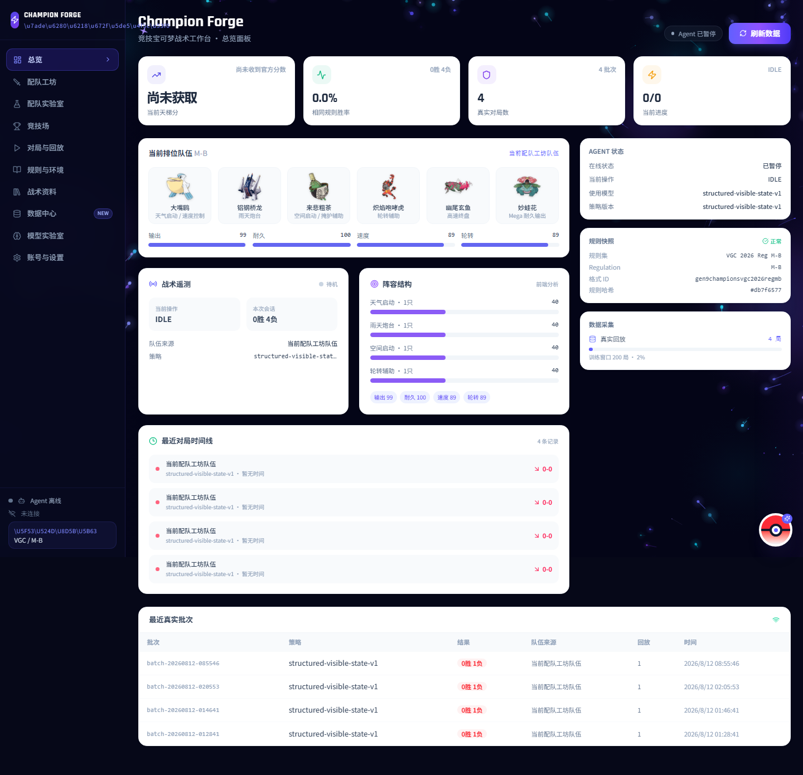
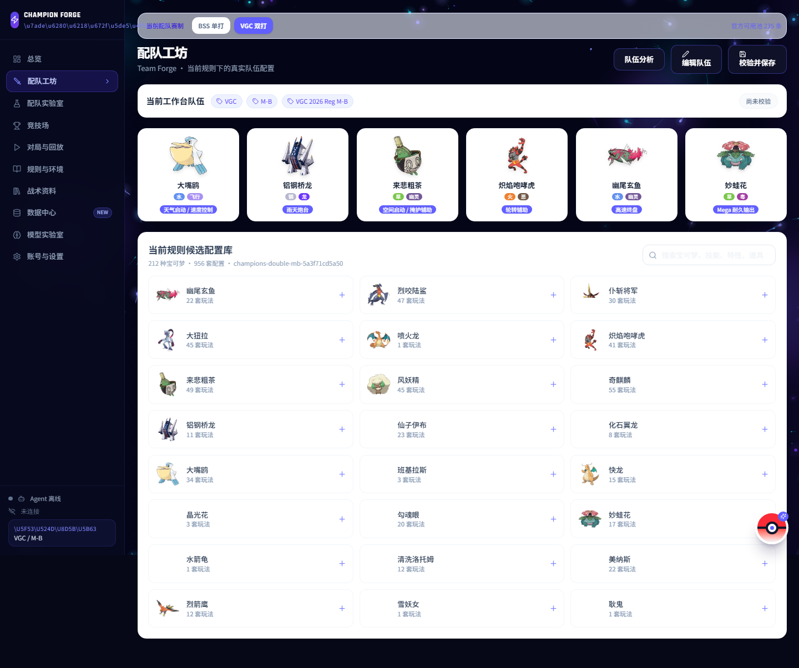
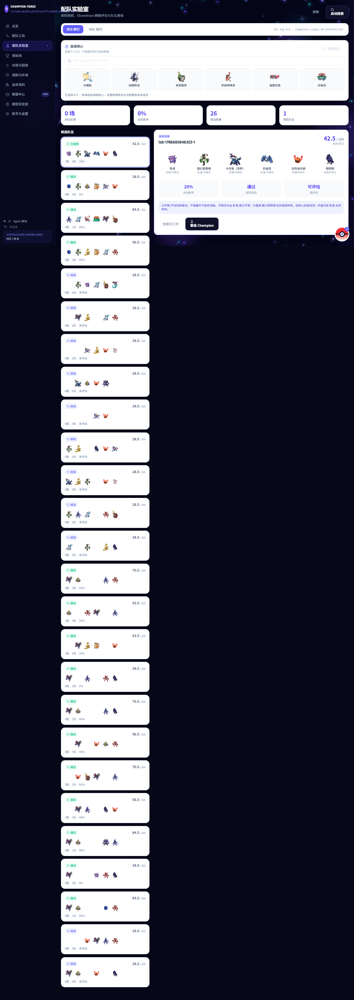
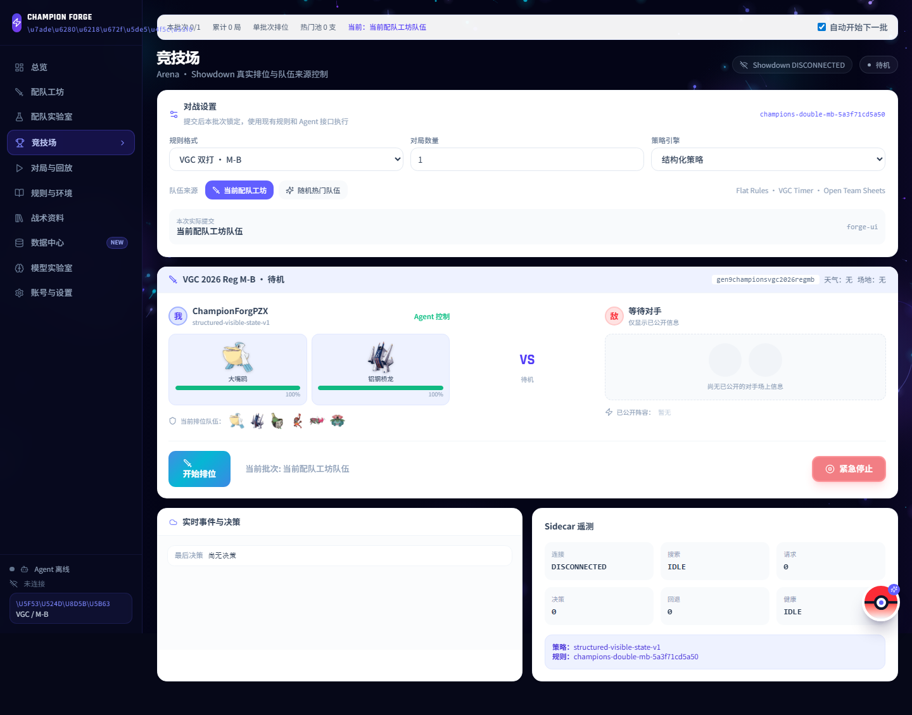
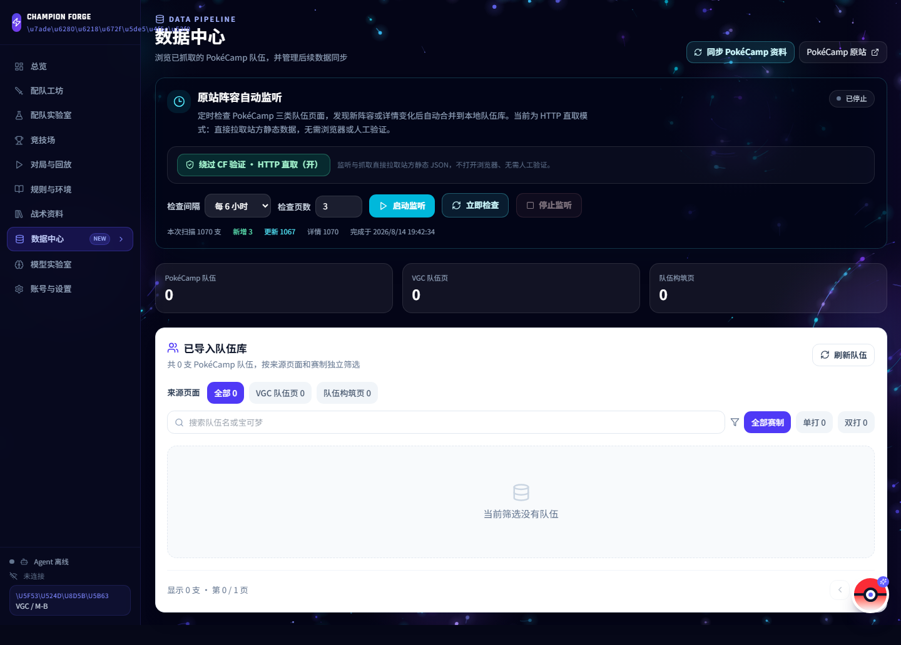
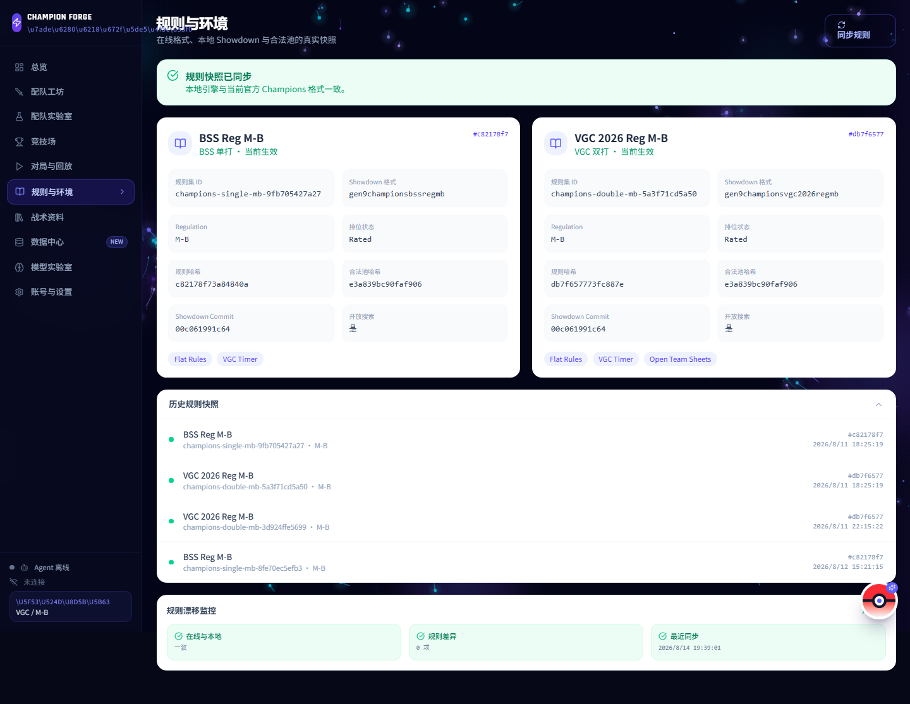
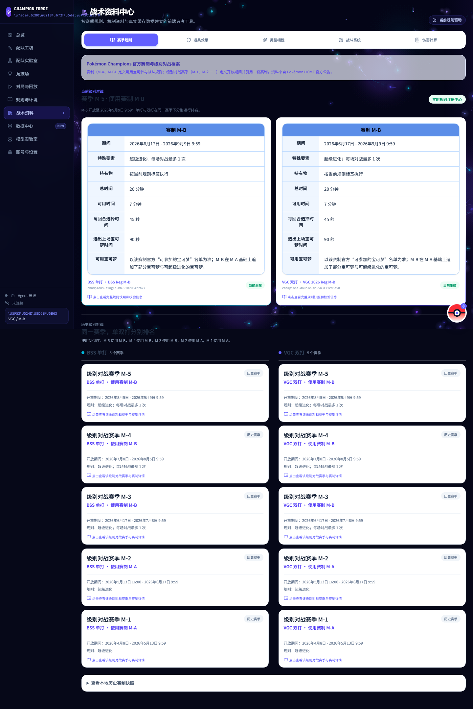
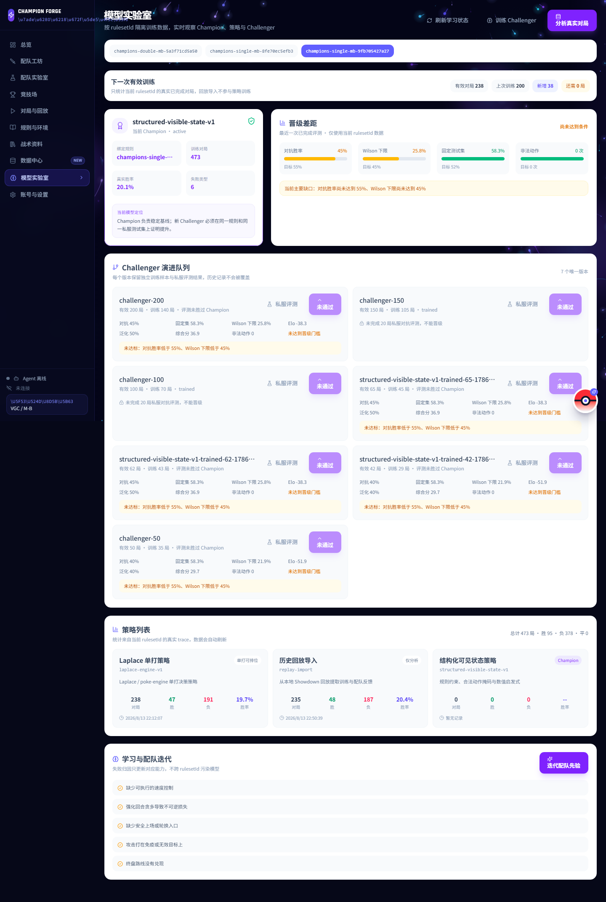

# Champion Forge

Champion Forge 是面向 Pokémon Champions 竞技玩家与对战 Agent 的本地工作台，覆盖配队、规则、数据、对战、回放和模型评测。

项目的核心原则是：**规则和 Showdown 校验负责约束，结构化搜索和数值评估负责决策，模型只在可验证边界内行动。**

## 当前界面

### 总览：实时工作台

总览页集中显示当前规则、队伍、Agent 状态、训练进度、对局批次和近期记录。

### 配队工坊：规则内配置编辑

配队工坊按当前 rulesetId 加载合法候选池，支持切换 BSS 单打 / VGC 双打、查看六只成员、配置道具、特性、性格、能力点和招式，并执行当前规则校验。

### 配队实验室：候选队伍搜索与评估

实验室用于生成和比较候选队伍，展示规则校验、结构评分、本地评估和 Champion / Challenger 状态。

### 竞技场：对战设置与 Agent 控制

竞技场负责设置当前规则、对局数量、策略引擎、队伍来源和随机热门队伍。公开排位与本地评测的运行状态、紧急停止和对局计数都从这里进入。

### 数据中心：PokéCamp 队伍抓取与监听

数据中心通过 PokéCamp 公开静态 JSON 进行 HTTP 直取，支持赛事队伍、单打构筑、双打构筑三类来源，并按来源页面和赛制筛选。详情中的配置、战术说明、招式、道具和特性会合并到本地队伍库。

### 规则与战术资料

规则页展示当前与历史规则快照；战术资料页提供赛季、宝可梦、机制、属性、伤害计算和相关参考信息。

### 模型实验室与对局数据

模型实验室管理 Champion / Challenger、固定测试集、评测批次和晋级记录。对局与回放页保存每局的规则、队伍、策略版本、回放和失败归因。

## 功能说明

### 动态规则注册中心

- 自动发现当前 Pokémon Champions BSS / VGC 评级格式。
- 每个版本生成独立的 rulesetId。
- 保存 Showdown 格式、规则列表、合法池哈希和规则快照。
- 在线规则、本地 Showdown 和合法池不一致时进入 RULE_DRIFT，禁止继续构筑和排位。
- 历史规则、队伍、回放、模型和训练样本按 rulesetId 隔离。

### 配队与合法性

- BSS 单打与 VGC 双打使用独立的候选池和规则上下文。
- 原子配置包含宝可梦、形态、道具、特性、性格、能力点、招式和机制属性。
- 候选队伍经过 TeamValidator、合法池和当前格式联合校验。
- Mega 形态使用基础形态 + Mega 石参与 Showdown 校验，同时保留 Mega 前后特性展示。
- PokéCamp 中文字段会转换为 Showdown 可识别的英文名称，中文名称只用于界面展示。

### PokéCamp 数据管线

- 读取公开静态队伍列表 JSON、VGC 队伍详情和单打 / 双打构筑详情。
- 自动补齐每只宝可梦的配置、招式、道具、特性、性格、能力点和战术说明。
- 监听模式可按小时、每天或手动立即检查。
- HTTP 直取模式不打开浏览器，不需要人工验证；关闭后才使用原有浏览器会话流程。
- 不实现验证码识别、CF 绕过、批量账号或匹配操纵。

### Agent 与对战

- 规则状态编码 -> 合法动作 mask -> 候选动作 -> 价值评估 -> 提交动作。
- 策略引擎包含结构化策略，并预留 Laplace 单打实验入口。
- 可使用当前配队工坊队伍，也可从当前规则合法热门队池随机抽取。
- 每局保存可见状态、合法动作、最终动作、队伍版本、策略版本、rating、replay 和失败归因。
- 公开排位设置专用账号、单账号单连接、局数限制和紧急停止。
- 本地模型对抗使用本地 Showdown / 私服，不连接公开天梯。

### 训练与评测

- 每 50 局更新策略和价值模型，每 100 局或每日更新配队先验。
- Challenger 必须在相同 rulesetId 下通过固定回放、热门队池、自博弈、旧模型对战和时间切分测试。
- 综合评估包含对手强度修正胜率、Glicko / Elo、最近窗口胜率、固定测试集和跨队伍泛化。
- 未通过评测的 Challenger 不会覆盖 Champion。
- 规则换季时只热启动规则无关状态编码和战术知识，非法配置和旧赛季样本不会混入新规则。

## 技术架构

~~~text
React / Vite 前端 :5173
  ├─ 总览、配队工坊、配队实验室
  ├─ 竞技场、对局与回放、规则与战术资料
  ├─ PokéCamp 数据中心
  └─ 模型实验室、账号与设置

Node API :4174
  ├─ Rules Registry
  ├─ TeamValidator / Showdown Bridge
  ├─ PokéCamp HTTP 同步与监听
  ├─ Agent / Replay / Model API
  └─ 账号向导与凭据状态

Python sidecar
  ├─ poke-env 对战客户端
  ├─ 本地训练与自博弈
  ├─ 策略 / 价值评估
  └─ 回放与训练样本存储
~~~

## 安装与启动

环境要求：Node.js 18+、Python 3.11+、Git，以及现代浏览器。

~~~powershell
git clone https://github.com/lgcr12/pokemon-champion.git
cd pokemon-champion
npm install

npm run start:ai
# 另开终端
npm run dev:forge
~~~

打开 http://127.0.0.1:5173。API 默认地址为 http://127.0.0.1:4174。

Python sidecar：

~~~powershell
py -m venv .venv
.\.venv\Scripts\python.exe -m pip install -r .\sidecar\requirements.txt
~~~

## 常用验证

~~~powershell
node --check server.mjs
node --check server/pokecamp-http.mjs
npm run build:forge
npm run qa:rules-registry
npm run qa:agent-stack
~~~

## 主要接口

~~~text
GET  /api/rules/active
GET  /api/rules/history
POST /api/rules/sync
POST /api/pokecamp/http/crawl
GET  /api/pokecamp/teams
POST /api/pokecamp/monitor/start
POST /api/pokecamp/monitor/run
POST /api/validate-team
POST /api/agent/start
POST /api/agent/stop
GET  /api/agent/status
GET  /api/agent/replays
GET  /api/agent/models
~~~

## 数据与安全边界

- 队伍、配置、回放、训练记录和模型注册表写入本地 data/，默认不提交大体积运行数据。
- 账号密码使用 Windows DPAPI / Credential Manager 保存，不写入 README、日志、JSON 或前端状态。
- 日志会过滤 assertion、cookie、challenge 和 authorization 字段。
- 不绕过 Showdown 验证码、人机验证、代理锁或反滥用机制。
- 公开排位必须使用用户自己的专用账号，并由用户确认平台允许自动化。

## 项目结构

~~~text
src/app/                  React 工作台页面与组件
server.mjs                Node API 入口
server/rules-registry.mjs 动态规则注册中心
server/pokecamp-http.mjs  PokéCamp 静态 JSON 同步器
sidecar/                  Python poke-env / 训练 sidecar
scripts/                  QA、数据同步与构建脚本
data/                     本地缓存、回放、模型与训练记录
docs/                     当前分支 README 界面截图
~~~

## 当前限制

- 公开排位是否可自动化取决于平台当时的规则和账号状态。
- 当前截图中的 Agent 可能处于离线或暂停状态；这不代表本地规则、配队和数据中心不可用。
- PokéCamp 站方数据变化时，详情字段可能暂时缺失，监听会在下次同步重试。
- Showdown 校验是严格规则约束的一部分，但最终游戏平台合法性仍应以当前官方赛制和客户端为准。

## 许可证与数据来源

本项目用于个人研究、配队分析和本地模型评测。PokéCamp、Pokémon、Pokémon Champions、Pokémon Showdown 与相关数据属于各自权利人。

主要数据来源：

- [PokéCamp](https://pokecamp.cc/zh/champions/vgc-teams)
- [52Poké Wiki](https://wiki.52poke.com/)
- [Pokémon Showdown](https://github.com/smogon/pokemon-showdown)
